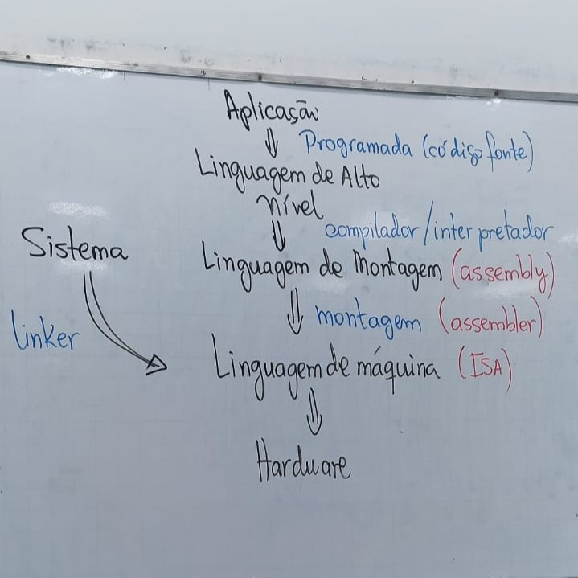
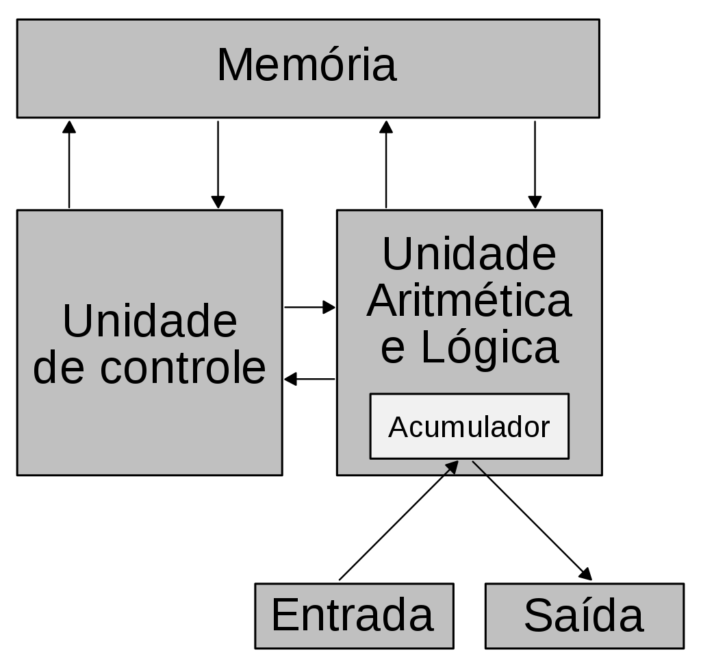

# Introdução

Os componentes essenciais de um computador são divididos em 3 camadas:
- **Software de aplicação** -> produtividade
- **Software de sistema** -> gerência de hardware
- **Hardware** -> parte lógica/física/binária

O hardware processa apenas sinais elétricos abstraídos em símbolos binários. Ele é capaz de executar um conjunto de operações, que são expressas em código binário. O conjunto de instruções é chamado de **ISA (Instruction Set Architecture)** e os códigos binários que abstraem as operações do ISA formam a **linguagem de máquina**.

Programar em linguagem de máquina é impraticável para o ser humano, pois:
- é muito distante da nossa linguagem (improdutivo)
- varia de acordo com os diversos hardwares e ISAs

Dessa forma, surgiram **níveis de abstração** de forma a beneficiar os usuários. Essas abstrações culminaram nas **linguagens de alto nível** e nos **softwares** que usamos e **independem do hardware**. Por outro lado, todo software programado em alto nível passa por um processo de **transformação** para que possa ser **executado pelo hardware**.

### Definições:
- **Compilar:** traduz o código de alto nível para código de máquina, permitindo que o hardware execute o programa diretamente.
- **Interpretar:** executa o código de alto nível linha por linha, sem traduzi-lo completamente para código de máquina de uma vez.
  
- **Assembly:** linguagem de baixo nível que utiliza minemônicos para representar as instruções de máquina, sendo mais legível para humanos do que o código binário puro.
- **Assembler:** programa que traduz código em assembly para linguagem de máquina.

## Conjunto de instruções
Um conjunto de instruções pode ser classificado como:
- **RISC (Reduced Instruction Set Computer)**: incluem instruções mais simples em menor quantidade.
- **CISC (Complex Instruction Set Computer)**: incluem instruções mais complexas e em maior quantidade.

    ||RISC|CISC|
    |:---:|---|---|
    |**Instruções**|- consome 1 ciclo de clock|- pode consumir mais de 1 ciclo de clock|
    ||- baixo número de instruções|- grande número de instruções|
    ||- mais simples|- mais complexas|
    |**Projeto**|- centrado no software|- centrado no hardware|
    |**Memória**|- uso menos eficiente|- uso mais eficiente|
    |**Execução**|- direto no hardware|- microprograma|

## Modelo atual de computador

O modelo atual de computadores baseia-se na arquitetura de **Von Neumann**, onde dados e instruções são armazenados na mesma memória. Isso permite que o computador seja programável e execute diferentes tarefas a partir da mesma estrutura física.

Salvar o programa na máquina é um processo crucial para a execução, permitindo que o sistema operacional ou o usuário gerencie a memória de forma eficiente.

- **Memória:** armazena tanto os dados quanto o programa que será executado.
