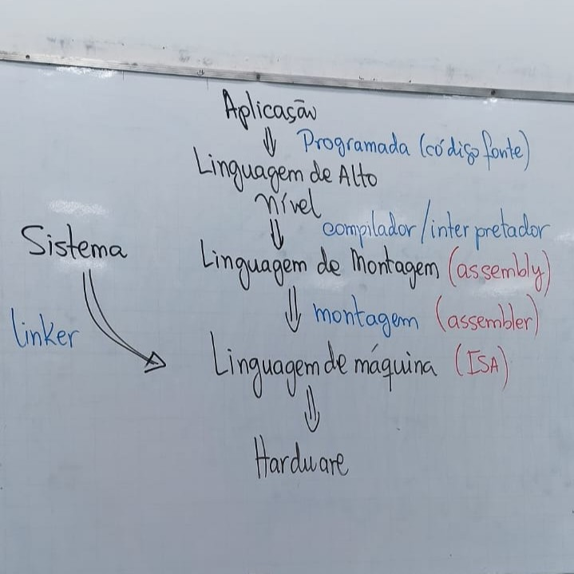
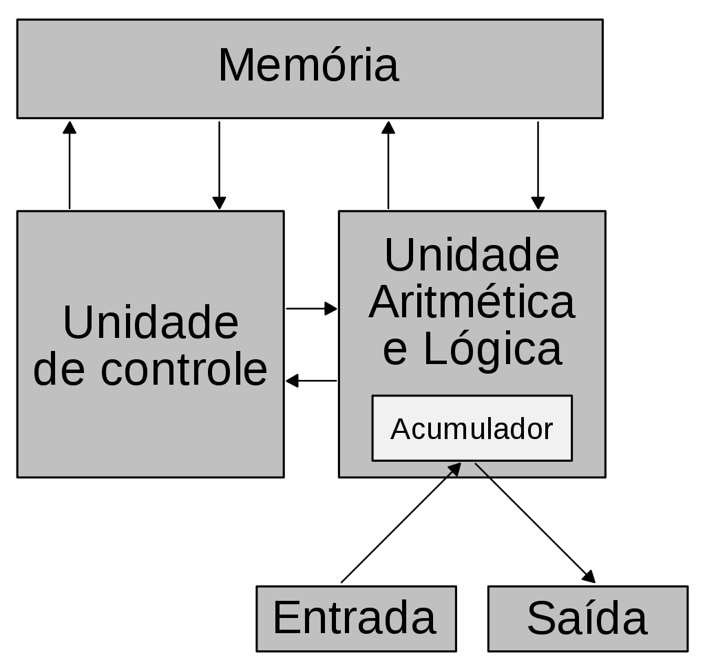

# Resumo - Introdução
- **Hardware**: executa um conjunto de operações (binário)
    - **ISA (Instruction Set Architecture)**: conjunto de instruções
        - **Linguagem de máquina**: códigos binários que abstraem as operações do ISA

## Níveis de abstração:

- todo software programado em alto nível passa por um processo de **transformação** para que possa ser **executado pelo hardware**.

## Conjunto de instruções

||RISC|CISC|
|:---:|---|---|
|**Instruções**|- consome 1 ciclo de clock|- pode consumir mais de 1 ciclo de clock|
||- baixo número de instruções|- grande número de instruções|
||- mais simples|- mais complexas|
|**Projeto**|- centrado no software|- centrado no hardware|
|**Memória**|- uso menos eficiente|- uso mais eficiente|
|**Execução**|- direto no hardware|- microprograma|

## Modelo atual de computador

- **Memória:** armazena tanto os dados quanto o programa que será executado.